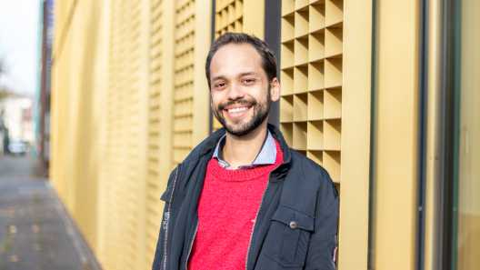

# Marcelo L. Zoccoler

## Contact

- **GitHub:** [zoccoler](https://github.com/zoccoler)
- **LinkedIn:** [marcelo-l-zoccoler](https://www.linkedin.com/in/marcelo-l-zoccoler-122a0bba/)
- **Bluesky:** [@mazoc.bsky.social](https://bsky.app/profile/mazoc.bsky.social)
- **X (Twitter):** [@zoccolermarcelo](https://x.com/zoccolermarcelo)

---

## Profile

I am a Electrical Engineer and Software Developer with 10+ years experience with signal and image processing, including machine learning and large n‑dimensional data. Experience with embedded systems programming, back‑ and front‑end software development and containerization strategies. Easy‑going and dedicated professional, skilled at building intuitive data visualization tools and leveraging new technologies to streamline workflows and solve complex analytical problems

---

## Education

- **PhD, Electrical Engineering**  
  School of Electrical and Computer Engineering (FEEC), University of Campinas ([UNICAMP](https://unicamp.br/en/)), 2019
- **Master's, Electrical Engineering**  
  School of Electrical and Computer Engineering (FEEC), University of Campinas ([UNICAMP](https://unicamp.br/en/)), 2014
- **Master's, Biomedical Engineering**  
  Université Joseph Fourier (UJF, now called [Université Grenoble Alpes](https://www.univ-grenoble-alpes.fr/english/)), 2011
- **Bachelor's, Electrical Engineering**  
  School of Electrical and Computer Engineering (FEEC), University of Campinas ([UNICAMP](https://unicamp.br/en/)), 2010

---

## Professional Experience

- **Postdoctoral Researcher / Image Data Scientist**  
  [Cluster of Excellence Physics of Life (PoL) ‑ TU Dresden](https://physics-of-life.tu-dresden.de/), Dresden, Germany  
  *Sep. 2021 - Present*
  - Provided tailored image quantification solutions to researchers from local campus (TU Dresden and Max Planck Institute (MPI‑CBG)), including tasks like image segmentation, denoising, registration, feature extraction, and data visualization.
  - Developed and maintained several napari (open‑source image visualization software) plugins, in particular for unsupervised Machine Learning via Dimensionality Reduction and Clustering algorithms, supervised Machine Learning for temporal feature  classification and Phasor Analysis of Fluorescence Lifetime Imaging Microscopy and hyperspectral data.
  - Taught Python Programming, Image Processing, Data Visualization, Statistical Analysis and Machine Learning for students on campus.
  - Coordinated Research Data Management via OMERO (open‑source platform for image data management) and developed scripts for automated server workflows.
- **Technological and Industrial Development Researcher**  
  [Center for Biomedical Engineering (CEB) ‑ University of Campinas (UNICAMP)](https://www.ceb.unicamp.br/), Campinas, Brazil  
  *Jul. 2020 - Feb. 2021*
  - Developed smart analysis of Hospital das Clínicas equipment inventory data and maintenance status during the COVID19 pandemic.
- **Technical Assistant**  
  [Center for Biomedical Engineering (CEB) ‑ University of Campinas (UNICAMP)](https://www.ceb.unicamp.br/), Campinas, Brazil  
  *Jul. 2019 - Jun. 2020*
  - Wrote documentation and parallelised code for the research project entitled ”Multi‑scale mathematical modeling of the neuromuscular system for studying the influence of amyotrophic lateral sclerosis on muscle force control”.
- **Masters and PhD Researcher**  
  [School of Electrical and Computer Engineering (FEEC), University of Campinas (UNICAMP)](https://www.fee.unicamp.br/), Campinas, Brazil  
  *Jan. 2012 - Jun. 2019*
  - Designed and built microfluorimetry system for fluorescence imaging.
  - Performed experiments with cells to generate fluorescence images related to calcium concentration, membrane potential and vesicle tracking.
  - Implemented calcium calibration techniques onto fluorescence images.
  - Developed software for image analysis and real‑time signal processing.
  - Developed new techniques to filter cellular signals from noisy observations.
- **Research Assistant**  
  [French Alternative Energies and Atomic Energy Commission (CEA)](https://www.cea.fr/english/Pages/Welcome.aspx), Grenoble, France  
  *Jan. 2011 - Jul. 2011*
  - Analyzed fluorescence images from microtubules and tracked fluorescent beads.
  - Modeled filament mechanical resistance from microtubule fluorescence images.
- **Internship**  
  Daitan Group, Campinas, Brazil  
  *Jan. 2010 - Jul. 2010*
  - Assisted testing bug fixes on VoIP communication protocols.
- **Undergraduate Researcher**  
  [School of Electrical and Computer Engineering (FEEC), University of Campinas (UNICAMP)](https://www.fee.unicamp.br/), Campinas, Brazil  
  *Jun. 2008 - Jun. 2009*
  - Developed interface and software for an ultra‑sonic transducer characterization system.

---

## Skills

- Programming Languages / Platforms: Python, C, MATLAB
- DevOps: Docker, git
- Microcontrollers: PIC, Arduino
- Teaching: Python Programming, Image Processing, Data Visualization, Statistical Analysis, Machine Learning
- Image Processing: Segmentation, Registration, Denoising, Feature Extraction, Classification
- Machine Learning: Dimensionality Reduction, Clustering, Supervised Classification
- Data Management: OMERO, Research Data Management, Data Visualization
- Data Analysis: Phasor Analysis, Hyperspectral Data Analysis, Statistical Analysis, Time Series Analysis
- Soft Skills: Accelerated Learning, Problem Solving, Critical Thinking, Ethical Decision Making, Teamwork, Scientific Communication

---

## Languages

- English (Fluent)
- Portuguese (Native)
- French (Advanced)
- German (Basic)

---

## Software

Here is a list of my main software and plugins:

- [napari-flim-phasor-plotter](https://github.com/zoccoler/napari-flim-phasor-plotter)  
  *A napari plugin for FLIM phasor analysis.*
- [napari-signal-selector](https://github.com/zoccoler/napari-signal-selector)  
  *A napari plugin for selecting and annotating signals in images.*
- [napari-signal-classifier](https://github.com/zoccoler/napari-signal-classifier)  
  *A napari plugin for machine learning-based signal classification.*
- [nap-plot-tools](https://github.com/zoccoler/nap-plot-tools)  
  *A NAPari PLOTter TOOLbar and tools for additional functionalities.*
- [PoET: A software for measuring pore edge tension of biomembranes](https://edmond.mpg.de/dataset.xhtml?persistentId=doi:10.17617/3.7H)  
  *A software for measuring pore edge tension of biomembranes.*
- [napari-metroid](https://github.com/zoccoler/napari-metroid)  
  *A napari plugin that creates several regions of interest of similar area over cells in a fluorescence video (2D+time). It measures intensity means over time and performs signal denoising: fixes photobleaching and separates signal from noise by means of blind source separation (with or without wavelet filtering).*
- [metroid](https://doi.org/10.6084/m9.figshare.11344046.v1)  
  *Computational tool to filter subcellular transmembrane potential signals from noisy single cell fluorescence videos.*
- [Cell electrochemical simulator](https://github.com/zoccoler/Cell_electrochemical_simulator)  
  *A simulator for the electrochemical behavior of a cell membrane, for educational purposes.*
- [GETS App](https://github.com/zoccoler/GETS_App)  
  *Web application of the [GETS](https://www.ceb.unicamp.br/redes-estrategicas/gets-gerenciamento-de-tecnologia-para-saude/) system for hospital equipment management and time-series predictions (repository in Portuguese).*

And here are some of the software, plugins or libraries I have contributed to:

- [napari](https://github.com/napari/napari)  
  *A fast, interactive, multi-dimensional image viewer for Python.*
- [napari-clusters-plotter](https://github.com/BiAPoL/napari-clusters-plotter)  
  *Cluster analysis and visualization for napari.*
- [napari-phasors](https://github.com/napari-phasors/napari-phasors)  
  *A napari plugin for phasor analysis.*
- [biaplotter](https://github.com/BiAPoL/biaplotter)  
  *Base napari widget for interactive plotting.*
- [napari-skimage-regionprops](https://github.com/haesleinhuepf/napari-skimage-regionprops)  
  *Feature extraction for labeled objects in images using regionprops from scikit-image.*
- [napari-crop](https://github.com/BiAPoL/napari-crop)
  *A napari plugin for cropping images and volumes.*
- [napari-omero](https://github.com/tlambert03/napari-omero)  
  *Browse your OMERO database from within napari.*
- [napari-plot-profile](https://github.com/haesleinhuepf/napari-plot-profile)  
  *A napari plugin for plotting line profiles of images and 3D views out of 2D images.*

## Open-Source Training Materials

- [BioImage Analysis and Data Processing Workshop 2025](https://biapol.github.io/BioImage-Analysis-and-Data-Processing-Workshop-2025/intro.html)  
  *Workshop content for Bio-Image Analysis and Data Processing taught in VMCF Microscopy Facility, Vinicna 7, Prague, Czechia.*
- [AMHCT Lecture - Navigating the Reproducibility Storm with Bio-Image Analysis 2025](https://biapol.github.io/AMHCT_Bio_Image_Analysis_2025/intro.html)  
  *Lecture in the Advanced Methods & Human Cell Technologies (AMHCT) as part of the Regenerative Biology and Medicine Master's Program.*
- [QM Course - Lectures on Bio-Image Analysis with napari Plugins 2025](https://biapol.github.io/QM_Course_Bio_Image_Analysis_with_napari_2025/intro.html)  
  *Course materials for bioimage analysis with napari.*
- [Trends in Microscopy 2025](https://biapol.github.io/TrendsInMicroscopy_2025/intro.html)  
  *Course contents for BiAPoL "Interactive Open-source Image Analysis and Scientific Plotting" Workshop at Trends in Microscopy conference 2025.*
- [DIGS-BB Bio-Image Analysis with napari 2024](https://biapol.github.io/DIGS-BB_LM_Course_Bio-Image_Analysis_2024/intro.html)  
  *Lecture for the DIGS-BB Light Microscopy Course 2024.*
- [BioImage Analysis and Data Processing Workshop 2024](https://biapol.github.io/BioImage-Analysis-and-Data-Processing-Workshop-2024/intro.html)  
  *Workshop content for Bio-Image Analysis and Data Processing taught in VMCF Microscopy Facility, Vinicna 7, Prague, Czechia.*
- [QM Course Lectures on Bio-Image Analysis with napari 2024](https://zoccoler.github.io/QM_Course_Bio_Image_Analysis_with_napari_2024/intro.html)  
  *QM course lectures about bio-image analysis using napari taught at VMCF, Charles University in Prague.*
- [Bio-image analysis, biostatistics, programming and machine learning for computational biology](https://github.com/BiAPoL/Bio-image_Analysis_with_Python)  
  *Training resources for Python beginners who want to dive into image processing with Python. It specifically aims for students and scientists working with microscopy images in the life sciences.*
- [PoL Bio-Image Analysis Training School - Early Career Track 2023](https://biapol.github.io/PoL-BioImage-Analysis-TS-Early-Career-Track/intro.html)  
  *Training materials for Early Career Track as part of the [PoL Bio-Image Analysis Symposium 2023](https://physics-of-life.tu-dresden.de/events/2023/08/28/pol-bioimage-analysis-symposium-2023) at the Cluster of Excellence Physics of Life (PoL), TU Dresden, Germany.*
- [napari Introduction 4 Image Analysis and Data Processing in Super-Resolution Microscopy 2023](https://github.com/zoccoler/napari-introduction-4-Image-Analysis-and-Data-Processing-in-Super-Resolution-Microscopy-2023)  
  *napari introduction materials for the "Image Analysis and Data Processing (not only) in Super-Resolution Microscopy 2023", taught at VMCF, Charles University in Prague*
- [GPU-Accelerated Image Processing on Cloud 2023](https://github.com/zoccoler/GPU_Accelerated_Image_Processing_on_Cloud_NEUBIAS_Defragmentation_TS2_2023)  
  *Material for the [NEUBIAS Defragmentation Training School 2](https://eubias.org/NEUBIAS/training-schools/neubias-academy-home/defragmentation-training-school-2023/), workshop section entitled: Parallelization and heterogeneous computing: from pure CPU to GPU-accelerated image processing, taught at Porto, Portugal.*
- [Quantitative Bio-Image Analysis with Python](https://biapol.github.io/Quantitative_Bio_Image_Analysis_with_Python_2022/intro.html)  
  *Materials for the Quantitative Bio-Image Analysis with Python course at the Cluster of Excellence Physics of Life (PoL), TU Dresden, Germany.*
- [DIGS-BB Bio-Image Analysis with napari 2022](https://biapol.github.io/DIGS-BB_LM_Course_Bio-Image_Analysis_2022/intro.html)  
  *Lecture for the DIGS-BB Light Microscopy Course 2022.*
- [I2K 2022 napari workshop](https://github.com/haesleinhuepf/I2K2022-napari-workshop)  
  *Materials for the napari workshop at the [I2K 2022 - From Images to Knowledge](https://2022.i2kconference.org/) conference.*
- [Image analysis with Python and Napari - A Helmholtz Imaging Summer Academy 2022](https://biapol.github.io/HIP_Introduction_to_Napari_and_image_processing_with_Python_2022/intro.html)  
  *Introduction to napari and image processing with Python for the Helmholtz Imaging Summer Academy 2022.*

---

## Publications

---

## Latest Contributions
<!--contrib-start-->
- **[napari-phasors/napari-phasors](https://github.com/napari-phasors/napari-phasors)**: [#108 Highlight optional](https://github.com/napari-phasors/napari-phasors/pull/108) (merged 2025-07-29)
- **[BiAPoL/biaplotter](https://github.com/BiAPoL/biaplotter)**: [#77 Relax numpy upper version constraint in dependencies](https://github.com/BiAPoL/biaplotter/pull/77) (merged 2025-07-29)
- **[BiAPoL/napari-clusters-plotter](https://github.com/BiAPoL/napari-clusters-plotter)**: [#454 Versioned docs](https://github.com/BiAPoL/napari-clusters-plotter/pull/454) (merged 2025-07-16)
- **[claudidagostino/Brightfield-3D-models-image-analysis](https://github.com/claudidagostino/Brightfield-3D-models-image-analysis)**: [#3 Update patch with sample data](https://github.com/claudidagostino/Brightfield-3D-models-image-analysis/pull/3) (merged 2025-07-10)
- **[BiAPoL/BioImage-Analysis-and-Data-Processing-Workshop-2025](https://github.com/BiAPoL/BioImage-Analysis-and-Data-Processing-Workshop-2025)**: [#5 Add additional info for users getting errors with Macs or Linux](https://github.com/BiAPoL/BioImage-Analysis-and-Data-Processing-Workshop-2025/pull/5) (merged 2025-07-03)
- **[zoccoler/Lifetime-Separation](https://github.com/zoccoler/Lifetime-Separation)**: [#6 Rev1 b](https://github.com/zoccoler/Lifetime-Separation/pull/6) (merged 2025-06-26)
- **[zoccoler/napari-flim-phasor-plotter](https://github.com/zoccoler/napari-flim-phasor-plotter)**: [#74 Add note about tau lines](https://github.com/zoccoler/napari-flim-phasor-plotter/pull/74) (merged 2025-06-23)
- **[zoccoler/example-jupyter-book](https://github.com/zoccoler/example-jupyter-book)**: [#4 Release test branch](https://github.com/zoccoler/example-jupyter-book/pull/4) (merged 2025-06-19)
- **[BiAPoL/AMHCT_Bio_Image_Analysis_2025](https://github.com/BiAPoL/AMHCT_Bio_Image_Analysis_2025)**: [#8 Add slides and links to them](https://github.com/BiAPoL/AMHCT_Bio_Image_Analysis_2025/pull/8) (merged 2025-06-03)
- **[BiAPoL/QM_Course_Bio_Image_Analysis_with_napari_2025](https://github.com/BiAPoL/QM_Course_Bio_Image_Analysis_with_napari_2025)**: [#1 Initial patch](https://github.com/BiAPoL/QM_Course_Bio_Image_Analysis_with_napari_2025/pull/1) (merged 2025-04-24)
- **[tlambert03/napari-omero](https://github.com/tlambert03/napari-omero)**: [#92 Forces napari to always open images as Image layers](https://github.com/tlambert03/napari-omero/pull/92) (merged 2025-03-20)
- **[BiAPoL/TrendsInMicroscopy_2025](https://github.com/BiAPoL/TrendsInMicroscopy_2025)**: [#6 Patch 2](https://github.com/BiAPoL/TrendsInMicroscopy_2025/pull/6) (merged 2025-03-17)
- **[zoccoler/napari-signal-selector](https://github.com/zoccoler/napari-signal-selector)**: [#20 Load sample data from url](https://github.com/zoccoler/napari-signal-selector/pull/20) (merged 2024-10-27)
- **[zoccoler/napari-signal-classifier](https://github.com/zoccoler/napari-signal-classifier)**: [#7 Sub signal classification clean](https://github.com/zoccoler/napari-signal-classifier/pull/7) (merged 2024-10-16)
- **[zoccoler/nap-plot-tools](https://github.com/zoccoler/nap-plot-tools)**: [#9 Add update icon path method](https://github.com/zoccoler/nap-plot-tools/pull/9) (merged 2024-10-10)
- **[haesleinhuepf/napari-skimage-regionprops](https://github.com/haesleinhuepf/napari-skimage-regionprops)**: [#89 Clip min eigenvalues to 0 to block negative values in sqrt](https://github.com/haesleinhuepf/napari-skimage-regionprops/pull/89) (merged 2024-10-05)
- **[BiAPoL/DIGS-BB_LM_Course_Bio-Image_Analysis_2024](https://github.com/BiAPoL/DIGS-BB_LM_Course_Bio-Image_Analysis_2024)**: [#5 Fix links and env name](https://github.com/BiAPoL/DIGS-BB_LM_Course_Bio-Image_Analysis_2024/pull/5) (merged 2024-09-18)
- **[BiAPoL/BioImage-Analysis-and-Data-Processing-Workshop-2024](https://github.com/BiAPoL/BioImage-Analysis-and-Data-Processing-Workshop-2024)**: [#2 remove extra exercise](https://github.com/BiAPoL/BioImage-Analysis-and-Data-Processing-Workshop-2024/pull/2) (merged 2024-08-06)
- **[zoccoler/napari-phasors](https://github.com/zoccoler/napari-phasors)**: [#3 Update combobox on layer renaming](https://github.com/zoccoler/napari-phasors/pull/3) (merged 2024-07-31)
- **[zoccoler/rtd-template](https://github.com/zoccoler/rtd-template)**: [#1 Add sentence to index](https://github.com/zoccoler/rtd-template/pull/1) (merged 2024-04-25)
- **[zoccoler/QM_Course_Bio_Image_Analysis_with_napari_2024](https://github.com/zoccoler/QM_Course_Bio_Image_Analysis_with_napari_2024)**: [#3 small name fixes](https://github.com/zoccoler/QM_Course_Bio_Image_Analysis_with_napari_2024/pull/3) (merged 2024-03-21)
- **[zoccoler/omero-image-processing-with-python](https://github.com/zoccoler/omero-image-processing-with-python)**: [#1 The beginning](https://github.com/zoccoler/omero-image-processing-with-python/pull/1) (merged 2023-10-11)
- **[schutyb/hsipy](https://github.com/schutyb/hsipy)**: [#2 Add dask support and rocketfft to speedup FFT](https://github.com/schutyb/hsipy/pull/2) (merged 2023-09-03)
- **[zoccoler/FLIM_analysis](https://github.com/zoccoler/FLIM_analysis)**: [#8 Create Workflow Example notebook](https://github.com/zoccoler/FLIM_analysis/pull/8) (merged 2023-08-31)
- **[BiAPoL/PoL-BioImage-Analysis-TS-Early-Career-Track](https://github.com/BiAPoL/PoL-BioImage-Analysis-TS-Early-Career-Track)**: [#34 Add pandas statistics plotting slides](https://github.com/BiAPoL/PoL-BioImage-Analysis-TS-Early-Career-Track/pull/34) (merged 2023-08-29)
- **[LIBREhub/napari-LatAm-workshop-2023](https://github.com/LIBREhub/napari-LatAm-workshop-2023)**: [#23 Reupload slice images notebook and update day2 file_path notebooks and slides](https://github.com/LIBREhub/napari-LatAm-workshop-2023/pull/23) (merged 2023-08-09)
- **[zoccoler/napari-introduction-4-Image-Analysis-and-Data-Processing-in-Super-Resolution-Microscopy-2023](https://github.com/zoccoler/napari-introduction-4-Image-Analysis-and-Data-Processing-in-Super-Resolution-Microscopy-2023)**: [#1 The beginning](https://github.com/zoccoler/napari-introduction-4-Image-Analysis-and-Data-Processing-in-Super-Resolution-Microscopy-2023/pull/1) (merged 2023-08-03)
- **[BiAPoL/scripts](https://github.com/BiAPoL/scripts)**: [#2 Xarray notebook](https://github.com/BiAPoL/scripts/pull/2) (merged 2023-08-02)
- **[BiAPoL/napari-crop](https://github.com/BiAPoL/napari-crop)**: [#46 bump version](https://github.com/BiAPoL/napari-crop/pull/46) (merged 2023-06-28)
- **[zoccoler/GPU_Accelerated_Image_Processing_on_Cloud_NEUBIAS_Defragmentation_TS2_2023](https://github.com/zoccoler/GPU_Accelerated_Image_Processing_on_Cloud_NEUBIAS_Defragmentation_TS2_2023)**: [#3 Change data from assistance nb](https://github.com/zoccoler/GPU_Accelerated_Image_Processing_on_Cloud_NEUBIAS_Defragmentation_TS2_2023/pull/3) (merged 2023-05-08)
- **[NEUBIAS/Defragmentation_TS2_EOSC-Life_2023](https://github.com/NEUBIAS/Defragmentation_TS2_EOSC-Life_2023)**: [#1 add day2 python installation material](https://github.com/NEUBIAS/Defragmentation_TS2_EOSC-Life_2023/pull/1) (merged 2023-05-04)
- **[haesleinhuepf/napari-segment-blobs-and-things-with-membranes](https://github.com/haesleinhuepf/napari-segment-blobs-and-things-with-membranes)**: [#21 Add gabor filter](https://github.com/haesleinhuepf/napari-segment-blobs-and-things-with-membranes/pull/21) (merged 2023-03-02)
- **[BiAPoL/stardist-envs](https://github.com/BiAPoL/stardist-envs)**: [#7 drop tensorrt 7](https://github.com/BiAPoL/stardist-envs/pull/7) (merged 2023-02-27)
- **[zoccoler/deep-learning-omero-scripts](https://github.com/zoccoler/deep-learning-omero-scripts)**: [#2 Updated readme](https://github.com/zoccoler/deep-learning-omero-scripts/pull/2) (merged 2023-02-14)
- **[BiAPoL/Quantitative_Bio_Image_Analysis_with_Python_2022](https://github.com/BiAPoL/Quantitative_Bio_Image_Analysis_with_Python_2022)**: [#40 Update on plugins](https://github.com/BiAPoL/Quantitative_Bio_Image_Analysis_with_Python_2022/pull/40) (merged 2022-10-18)
- **[zoccoler/short_examples_book](https://github.com/zoccoler/short_examples_book)**: [#1 add linked_regionprops function](https://github.com/zoccoler/short_examples_book/pull/1) (merged 2022-08-19)
- **[campaslab/napari-stress](https://github.com/campaslab/napari-stress)**: [#132 Plot layer features](https://github.com/campaslab/napari-stress/pull/132) (merged 2022-08-17)
- **[BiAPoL/blog](https://github.com/BiAPoL/blog)**: [#47 Add versioning steps](https://github.com/BiAPoL/blog/pull/47) (merged 2022-07-21)
- **[haesleinhuepf/napari-plot-profile](https://github.com/haesleinhuepf/napari-plot-profile)**: [#18 Add topographical view](https://github.com/haesleinhuepf/napari-plot-profile/pull/18) (merged 2022-05-21)
- **[haesleinhuepf/I2K2022-napari-workshop](https://github.com/haesleinhuepf/I2K2022-napari-workshop)**: [#8 minor fixes to images and notebook paths](https://github.com/haesleinhuepf/I2K2022-napari-workshop/pull/8) (merged 2022-05-10)
- **[matplotlib/napari-matplotlib](https://github.com/matplotlib/napari-matplotlib)**: [#44 Custom toolbar style for napari](https://github.com/matplotlib/napari-matplotlib/pull/44) (merged 2022-05-09)
- **[BiAPoL/Bio-image_Analysis_with_Python](https://github.com/BiAPoL/Bio-image_Analysis_with_Python)**: [#8 Lecture4](https://github.com/BiAPoL/Bio-image_Analysis_with_Python/pull/8) (merged 2022-04-25)
- **[napari/napari](https://github.com/napari/napari)**: [#4312 Fix black line ellipse](https://github.com/napari/napari/pull/4312) (merged 2022-03-31)
- **[zoccoler/napari-metroid](https://github.com/zoccoler/napari-metroid)**: [#12 Fix UI not found](https://github.com/zoccoler/napari-metroid/pull/12) (merged 2022-03-29)
- **[BiAPoL/Learning-groups-2022](https://github.com/BiAPoL/Learning-groups-2022)**: [#4 Create Batch_processing_solved_notebook.ipynb](https://github.com/BiAPoL/Learning-groups-2022/pull/4) (merged 2022-02-22)
- **[haesleinhuepf/BioImageAnalysisNotebooks](https://github.com/haesleinhuepf/BioImageAnalysisNotebooks)**: [#3 Annotate over image](https://github.com/haesleinhuepf/BioImageAnalysisNotebooks/pull/3) (merged 2022-02-09)
- **[zoccoler/flood-napari](https://github.com/zoccoler/flood-napari)**: [#6 update qt version style](https://github.com/zoccoler/flood-napari/pull/6) (merged 2021-12-13)
- **[zoccoler/blog](https://github.com/zoccoler/blog)**: [#3 updating my fork](https://github.com/zoccoler/blog/pull/3) (merged 2021-11-29)
- **[jo-mueller/napari-stl-exporter](https://github.com/jo-mueller/napari-stl-exporter)**: [#2 numpy array conversion](https://github.com/jo-mueller/napari-stl-exporter/pull/2) (merged 2021-10-06)
- **[zoccoler/Cell_electrochemical_simulator](https://github.com/zoccoler/Cell_electrochemical_simulator)**: [#9 advanced mode fully functional](https://github.com/zoccoler/Cell_electrochemical_simulator/pull/9) (merged 2021-06-30)
- **[zoccoler/GETS_App_binder](https://github.com/zoccoler/GETS_App_binder)**: [#2 Create LICENSE](https://github.com/zoccoler/GETS_App_binder/pull/2) (merged 2021-06-03)
- **[zoccoler/GETS_App](https://github.com/zoccoler/GETS_App)**: [#3 Create LICENSE](https://github.com/zoccoler/GETS_App/pull/3) (merged 2021-06-03)
- **[zoccoler/metroid](https://github.com/zoccoler/metroid)**: [#20 Update requirements.txt](https://github.com/zoccoler/metroid/pull/20) (merged 2020-09-23)
<!--contrib-end-->

---

_Last updated: August 2025_

